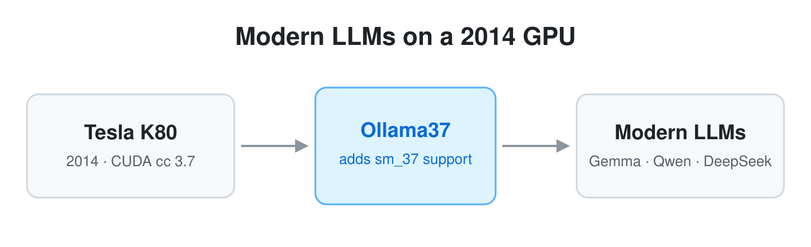
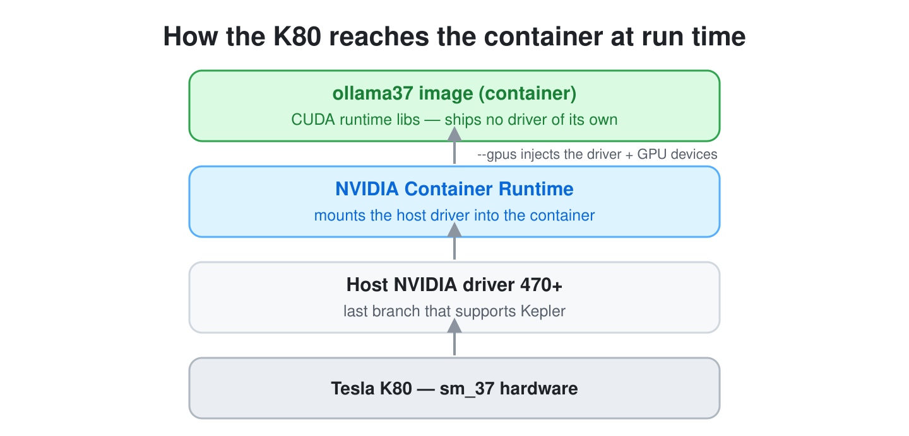
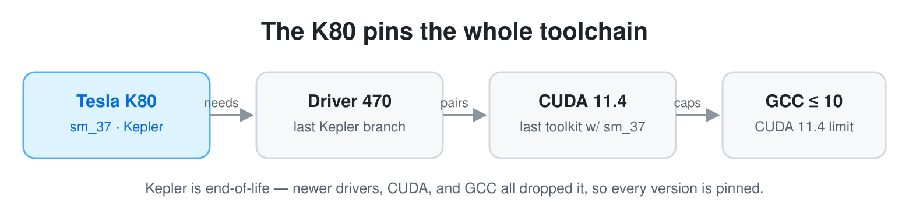
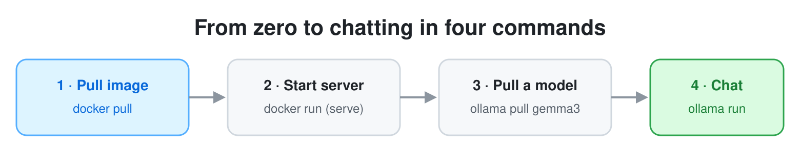
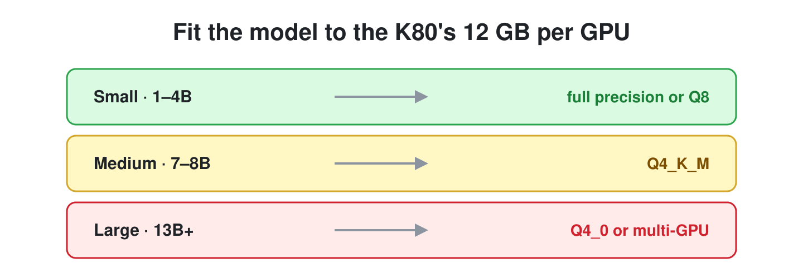
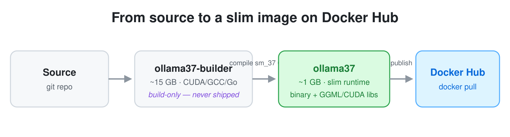

# Ollama37

**Run modern LLMs on the NVIDIA Tesla K80.** Ollama37 is a fork of [Ollama](https://github.com/ollama/ollama) that restores CUDA compute capability 3.7, so a 2014-era K80 can serve today's models — Gemma, Qwen, DeepSeek, and more — long after upstream dropped Kepler support.

[](LICENSE)
[](https://hub.docker.com/r/dogkeeper886/ollama37)
[](https://hub.docker.com/r/dogkeeper886/ollama37)



> [!IMPORTANT]
> **The Tesla K80 (compute capability 3.7) is the only hardware tested here** — it is what
> the project is built and tuned for. The published image now also compiles native CUBIN
> for the whole 470-era datacenter range (`sm_37`–`sm_86`, Kepler through Ampere), so a
> P100, V100, T4, A100 and similar cards *should* load it — but those are **not yet
> hardware-validated, so treat them as experimental**. Cards outside that range (Ada,
> Hopper) need a self-build — see [Building for other GPUs](#building-for-other-gpus).

## Contents

- [Why Ollama37](#why-ollama37)
- [Features](#features)
- [Requirements](#requirements)
- [Quick Start](#quick-start)
- [Tested Models](#tested-models)
- [How It's Built](#how-its-built)
- [Building for other GPUs](#building-for-other-gpus)
- [Troubleshooting](#troubleshooting)
- [Documentation](#documentation)
- [Contributing](#contributing)
- [License](#license)

## Why Ollama37

The Tesla K80 is a 24 GB (2×12 GB) datacenter GPU you can buy used for very little, but
modern Ollama won't run on it: CUDA 12, recent drivers, and upstream's prebuilt binaries
all dropped Kepler (`sm_37`). Ollama37 keeps that hardware useful by pinning the exact
toolchain the K80 still needs and shipping a ready-to-run image. Doing this by hand also
teaches the parts that "just works" hides — compiling CUDA kernels, matching GCC to CUDA,
and wrangling end-of-life drivers.

## Features

- **Tesla K80 support** — full CUDA compute capability 3.7 (`sm_37`), the tested target.
- **Broader datacenter range (experimental)** — the image also compiles native CUBIN for
  `sm_50`–`sm_86` (Maxwell through Ampere: P100, V100, T4, A100, …), so they can load it,
  though only the K80 is hardware-validated.
- **Fast cold start** — compiled to native CUBIN, so there's no multi-minute PTX JIT on
  container start (a PTX build re-JITs for ~3–4 min on every restart).
- **Qwen3.5 DeltaNet** — first Ollama fork to support the DeltaNet recurrent architecture.
- **Tool calling** — verified via the API and LangChain.

## Requirements

- A **Tesla K80** (the tested target), or another NVIDIA datacenter card in the
  `sm_37`–`sm_86` range (Maxwell→Ampere) — experimental, see the note at the top.
- **NVIDIA driver 470+** on the host. 470 is the last branch that supports Kepler —
  newer drivers dropped the K80.
- **Docker** with the **NVIDIA Container Runtime**.

The container ships no driver of its own. At run time the NVIDIA Container Runtime mounts
the host's driver in via `--gpus`, which is how the image reaches the K80:



Why those exact versions? The K80's age pins the entire chain — newer drivers, CUDA, and
GCC have all removed Kepler support:



## Quick Start



Pull the prebuilt image from Docker Hub and run it (no build required):

```bash
docker run -d \
  --name ollama37 \
  --runtime=nvidia \
  --gpus all \
  -p 11434:11434 \
  -v ollama-data:/root/.ollama \
  dogkeeper886/ollama37:latest
```

Then pull a model and chat:

```bash
docker exec ollama37 ollama pull gemma3:4b
docker exec ollama37 ollama run gemma3:4b "Why is the sky blue?"
```

Or call the API:

```bash
curl http://localhost:11434/api/generate -d '{
  "model": "gemma3:4b",
  "prompt": "Why is the sky blue?",
  "stream": false
}'
```

For Docker Compose and the full configuration, see [docker/README.md](docker/README.md).

## Tested Models



A K80 has **12 GB VRAM per GPU** (24 GB for a dual-GPU board). Size quantization to fit:

| Model size    | Quantization         |
|---------------|----------------------|
| Small (1–4B)  | Full precision or Q8 |
| Medium (7–8B) | Q4_K_M               |
| Large (13B+)  | Q4_0 or multi-GPU    |

Verified on K80: `gemma3:4b`, `gemma3:27b`, `gemma4:e4b`, `gemma4:26b`, `qwen3.5:9b`,
`qwen3.5:27b`, `gpt-oss:20b`, `deepseek-r1:7b`, `ministral-3`, `functiongemma`.

## How It's Built

Ollama37 is split into two Docker images so the thing you run stays small:



- **`ollama37-builder` (~15 GB)** — the build environment only: CUDA 11.4 toolkit, GCC 10
  and CMake 4 (compiled from source, ~90 min the first time), and Go. It is never shipped.
- **`ollama37` (~1 GB)** — a multi-stage build. The code is compiled *inside* the builder
  with the `CUDA 11 K80` preset (native CUBIN for `sm_37`–`sm_86`, the 470 datacenter sweep), then only the
  artifacts — the `ollama` binary, the GGML/CUDA libraries, the bundled CUDA runtime libs
  (cuBLAS, cuBLASLt, cudart), and the GCC 10 runtime libs — are copied onto a slim
  `rockylinux:8-minimal` base. This is the image published to Docker Hub.

To build it yourself:

```bash
cd docker
make build          # builds the builder image (first time only), then the runtime image
docker compose up -d
```

## Building for other GPUs

The published image now targets the whole 470-era datacenter range (`sm_37` through
`sm_86`, Kepler through Ampere), but **only the K80 is tested** — the other architectures
are compiled in and should load, yet are unvalidated, so you are on your own there.

For cards **outside** that range — Ada (RTX 40-series) and Hopper (H100), which need
CUDA 12+ and a newer driver — you have to build it yourself: `CMakePresets.json` ships
`CUDA 12` / `CUDA 13` presets for them. Note that moving to a newer CUDA/driver **drops
K80 support** — the very thing this project pins CUDA 11.4 / driver 470 to keep. See
[docker/README.md](docker/README.md) and the architecture map in
[docs/research/470-arch-support-map.md](docs/research/470-arch-support-map.md).

## Troubleshooting

The most common K80 snag: `nvidia-smi` works inside the container but Ollama reports **0
GPUs**, because the host is missing the UVM device files. Fix it on the host with:

```bash
nvidia-modprobe -u -c=0
```

This and other issues (GPU not detected, model load failures, build problems) are covered
in [docker/README.md](docker/README.md#troubleshooting).

## Documentation

- **[docker/README.md](docker/README.md)** — full build system: architecture, build
  commands, configuration, and troubleshooting.
- **[CLAUDE.md](CLAUDE.md)** — development process and contribution workflow.
- **[Upstream Ollama](https://github.com/ollama/ollama)** — the original project.

## Contributing

Issues and pull requests are welcome — Tesla K80 compatibility reports and fixes
especially. See the [issue tracker](https://github.com/dogkeeper886/ollama37/issues).

## License

MIT, the same as upstream Ollama. See [LICENSE](LICENSE).
