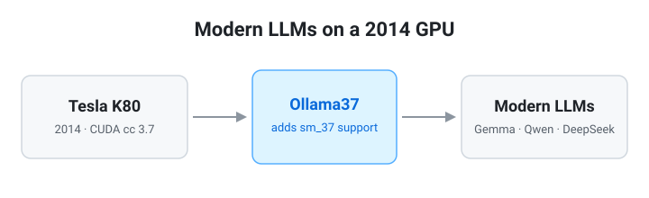
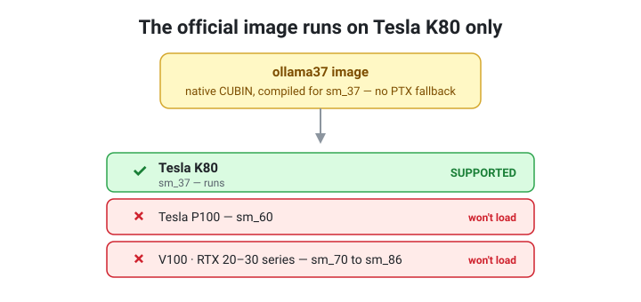
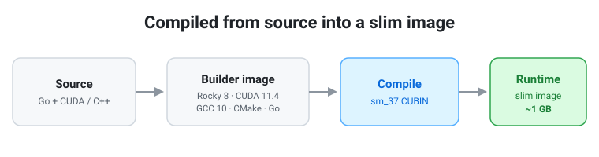

# Ollama37

**Run modern LLMs on Tesla K80 GPUs.** Ollama37 is a fork of [Ollama](https://github.com/ollama/ollama) that adds CUDA compute capability 3.7, so a 2014-era K80 can serve today's models — Gemma, Qwen, DeepSeek, and more.



> [!IMPORTANT]
> **The official image runs on Tesla K80 (sm_37) only.** It is compiled to native
> CUBIN for sm_37 with no PTX fallback, so it will **not** load on a P100, V100,
> RTX card, or any other GPU. If you have different hardware, you must build it
> yourself (see [Building for other GPUs](#building-for-other-gpus)).



## Why

Running AI on a decade-old GPU is a forcing function: you learn to compile kernels,
manage GCC versions, debug drivers, and navigate end-of-life dependencies — skills you
never pick up when everything just works. Ollama37 packages that effort so a K80 can
run a modern Ollama.

## Quick Start

The K80 is the only supported target — confirm you have one before you start.

```bash
# Build
cd docker
make build

# Run
docker compose up -d

# Test
curl http://localhost:11434/api/tags
docker exec ollama37 ollama pull gemma3:4b
docker exec ollama37 ollama run gemma3:4b "Hello!"
```

## How It Works

Ollama37 uses a multi-stage Docker build that compiles everything from source and
produces a slim (~1 GB) runtime image. The build targets sm_37 directly as native
CUBIN, so there is no JIT delay on first run.



**Build environment:**
- Rocky Linux 8
- CUDA 11.4 toolkit
- GCC 10 (built from source)
- CMake 4.0 (built from source)
- Go 1.25.3
- NVIDIA driver 470+

## Model Recommendations

A K80 has **12 GB VRAM per GPU** (24 GB for a dual-GPU K80). Size your quantization to fit:

| Model Size   | Quantization            |
|--------------|-------------------------|
| Small (1–4B) | Full precision or Q8    |
| Medium (7–8B)| Q4_K_M                  |
| Large (13B+) | Q4_0 or multi-GPU       |

## Building for Other GPUs

The official image is K80-only by design — that is the hardware this project targets
and tests. The build system *can* target other architectures if you build it yourself:
`CMakePresets.json` ships a `CUDA 11` preset (PTX for sm_37 through sm_86) and `CUDA 12`
/ `CUDA 13` presets for newer cards. These paths are **unsupported** — they are not
tested here and you are on your own. See [docker/README.md](docker/README.md).

## Demo

[](https://www.youtube.com/watch?v=iYxgGsPu5rM)

**[Why I Run AI on 10-Year-Old GPUs: Ollama K80 Docker Build System & CI/CD Pipeline](https://www.youtube.com/watch?v=iYxgGsPu5rM)** — a walkthrough of the build system and the self-hosted CI/CD pipeline behind this fork.

## Documentation

- **[docker/README.md](docker/README.md)** — Full Docker build system docs (architecture, build commands, configuration, troubleshooting)
- **[CLAUDE.md](CLAUDE.md)** — Development process, branch workflow, and Claude Code instructions
- **[Upstream Ollama](https://github.com/ollama/ollama)** — The original Ollama project

## License

MIT (same as upstream Ollama).
