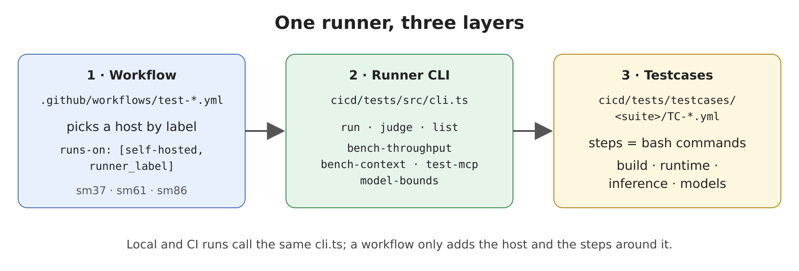
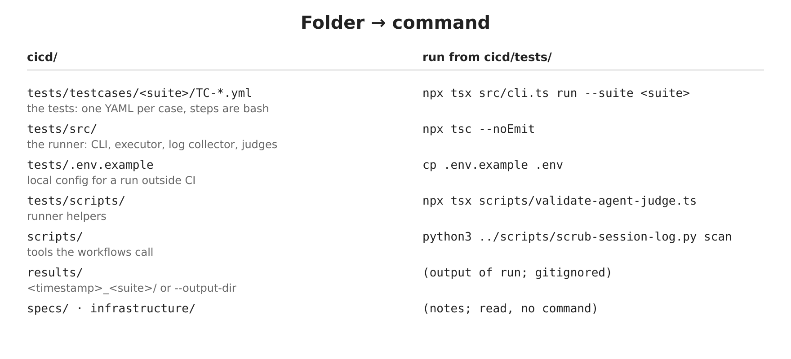
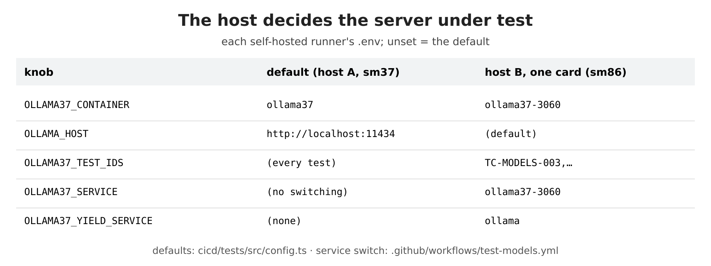
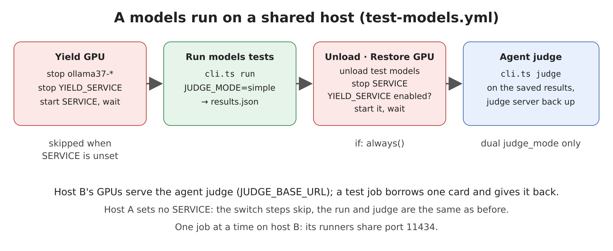

# cicd

YAML testcases check every ollama37 build on real GPUs, run by one TypeScript runner locally or in GitHub Actions. A second host now joins the K80 box: it shares its cards with the agent judge's server and runs just the tests that fit one card. A pipeline that hard-codes one container, one address and one test list breaks that host when it runs there. Each self-hosted runner's `.env` names its own server under test, and the models workflow borrows a card and returns it.

## 1. One runner, three layers



A workflow in `.github/workflows/test-*.yml` picks a self-hosted runner by `runner_label`. It calls `cicd/tests/src/cli.ts`, which runs the testcases in `cicd/tests/testcases/<suite>/TC-*.yml`. A testcase's steps are bash commands. A local run and a CI run call the same `cli.ts`.

| Workflow | Command |
|---|---|
| `test-build.yml` · `test-runtime.yml` · `test-inference.yml` · `test-models.yml` | `cli.ts run --suite <suite>` |
| `test-models.yml` | `cli.ts judge <results dir>` |
| `test-throughput.yml` | `cli.ts bench-throughput` |
| `test-context.yml` | `cli.ts bench-context` |
| `test-mcp.yml` | `cli.ts test-mcp` |
| `test-report-sweep.yml` | `cli.ts bench-throughput` · `test-mcp` · `model-bounds` |
| `test-pipeline.yml` | build → runtime → inference → models |

## 2. Folder → command



Run these from `cicd/tests/`:

| Folder | Holds | Command |
|---|---|---|
| `tests/testcases/<suite>/` | one YAML per testcase | `npx tsx src/cli.ts run --suite <suite> [--id <TC-ID>] [--dry-run]` |
| `tests/src/` | CLI, executor, log collector, judges | `npx tsc --noEmit` |
| `tests/.env.example` | config for a run outside CI | `cp .env.example .env` |
| `tests/scripts/` | runner helpers | `npx tsx scripts/validate-agent-judge.ts` |
| `scripts/` | tools the workflows call | `python3 ../scripts/scrub-session-log.py scan <log.jsonl>` |
| `results/` | run output, gitignored | written by `run`; `--output-dir <dir>` overrides |
| `specs/` · `infrastructure/` | notes | — |

Pass `--format json` to `run` or `judge` to print the summary as JSON.

## 3. The host decides the server under test



A self-hosted runner reads its own `.env` (in the runner's folder), so each host names its server there and the workflows stay the same. An unset knob takes the default from `cicd/tests/src/config.ts` or the workflow step.

| Knob | Default | Read by |
|---|---|---|
| `OLLAMA37_CONTAINER` | `ollama37` | testcase steps, log collector |
| `OLLAMA_HOST` | `http://localhost:11434` | testcase steps, perf commands, workflow steps |
| `OLLAMA37_TEST_IDS` | unset: every test | `cli.ts run` |
| `OLLAMA37_SERVICE` | unset: no service switch | `test-models.yml` |
| `OLLAMA37_YIELD_SERVICE` | unset | `test-models.yml` |

For a local run, set them in `cicd/tests/.env` or on the command line:

```bash
OLLAMA37_CONTAINER=ollama37-3060 npx tsx src/cli.ts run --suite models --id TC-MODELS-003
```

## 4. A models run on a shared host



`test-models.yml` stops `OLLAMA37_YIELD_SERVICE` and starts `OLLAMA37_SERVICE` as user systemd units, on a host whose runner sets `OLLAMA37_SERVICE`. It then runs the tests with the simple judge and saves `results.json`. It unloads the test models, restores the yielded service if that service is enabled, and only then runs the agent judge on the saved results. The switch steps skip on a host that leaves `OLLAMA37_SERVICE` unset.

The same split by hand:

```bash
JUDGE_MODE=simple npx tsx src/cli.ts run --suite models --output-dir ../results/models
JUDGE_MODE=dual   npx tsx src/cli.ts judge ../results/models
```

**Run one job at a time on a host with several runners: its test services share port 11434.**

## Quick start

```bash
cd cicd/tests
npm ci
npx tsx src/cli.ts list                                   # every testcase
npx tsx src/cli.ts run --suite models --id TC-MODELS-003  # one test, simple judge
```

In CI:

```bash
gh workflow run test-models.yml -f runner_label=sm86 -f test_id=TC-MODELS-003
```

## Diagrams

`docs/diagrams/render.sh` renders the PNGs from `docs/diagrams/*.svg`:

```bash
docs/diagrams/render.sh
```
